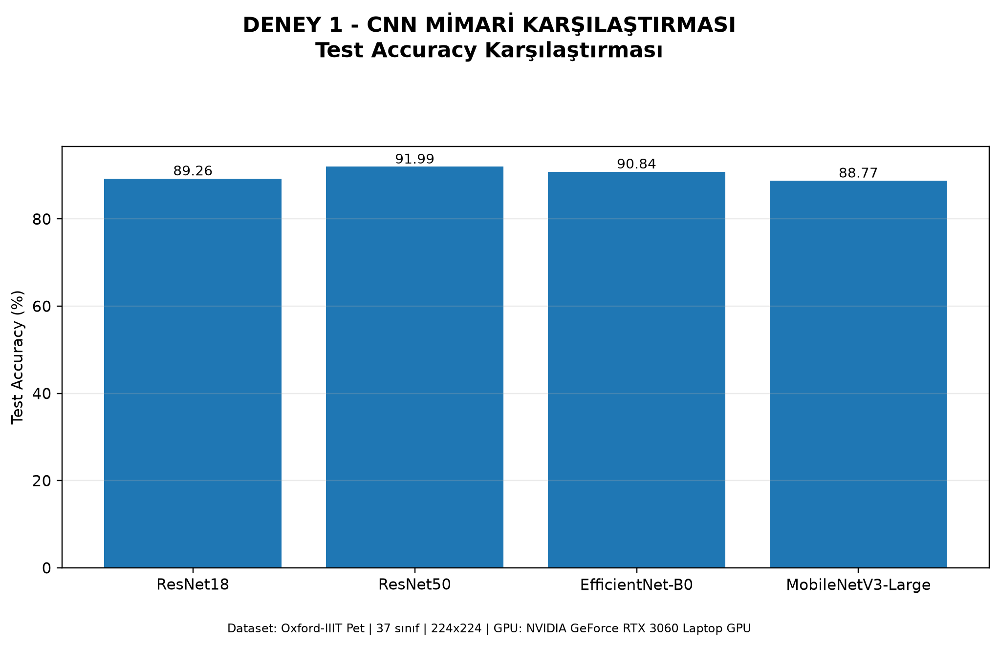
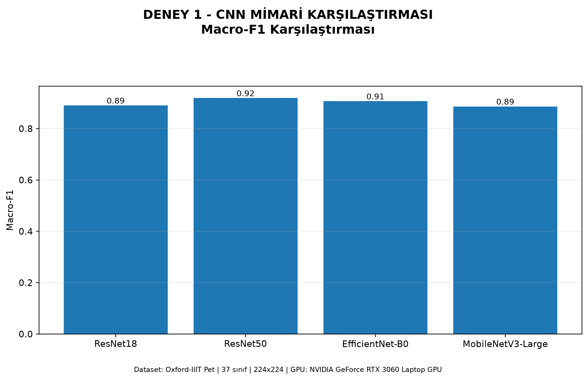
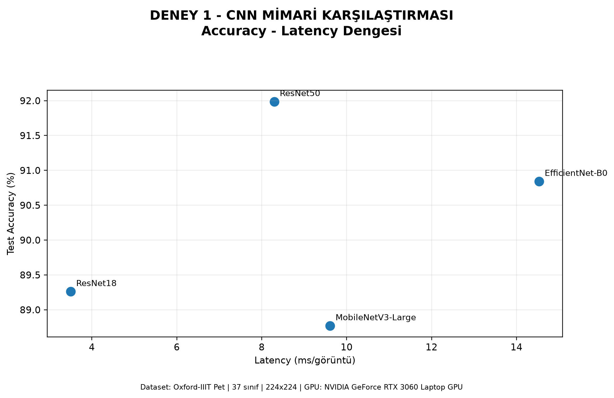
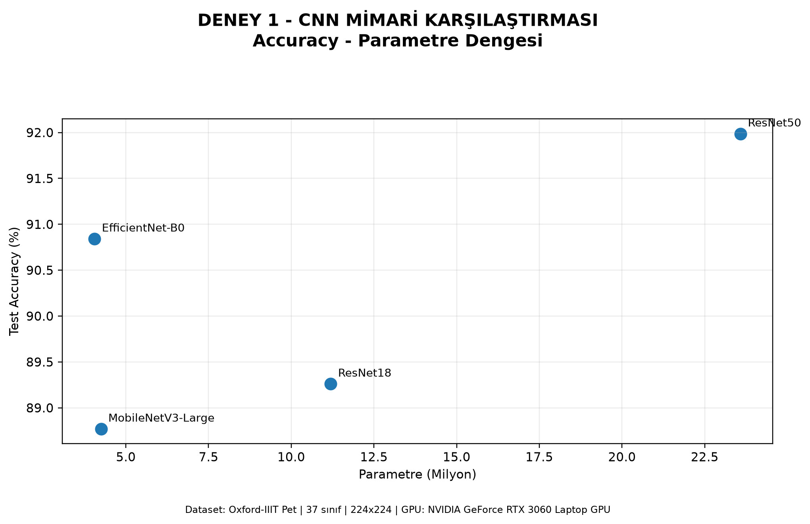
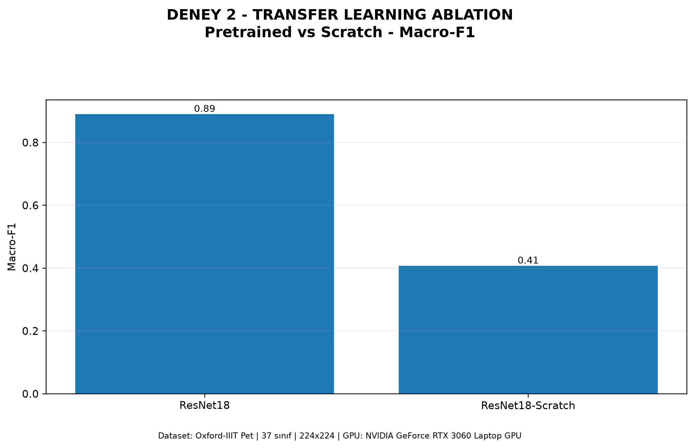
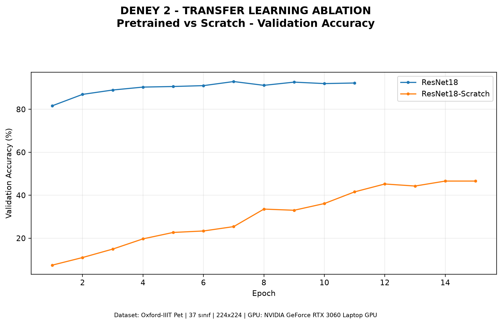

# CNN Architecture Benchmark

A PyTorch-based image classification benchmark comparing **ResNet18**, **ResNet50**, **EfficientNet-B0**, and **MobileNetV3-Large** on the **Oxford-IIIT Pet** dataset.

The project evaluates not only classification quality, but also the engineering trade-offs between **accuracy, Macro-F1, parameter count, model size, inference latency, FPS, training time, and GPU memory usage**.

It also includes a **transfer learning ablation study** comparing an ImageNet-pretrained ResNet18 with the same architecture trained from scratch.

---

## Project Goals

This experiment was designed around three main questions:

1. Does a deeper CNN provide a meaningful accuracy improvement?
2. Does a smaller model always run faster in practice?
3. How much difference does transfer learning make on a relatively small dataset?

The goal is to treat model selection as an engineering decision rather than choosing a network based on accuracy alone.

---

## Dataset

**Oxford-IIIT Pet**

- 37 classes
- 7,349 total images
- Train: 2,944
- Validation: 736
- Test: 3,669
- Input size: `224 x 224`
- RGB images
- Batch size: `32`
- Seed: `42`

The official `trainval` split is divided into training and validation subsets using a stratified split. The official test split is kept for final evaluation.

---

## Models

### ResNet18

A lightweight residual network used as the main baseline.

Residual blocks learn:

```text
y = F(x) + x
```

Skip connections help gradient flow and make deeper convolutional networks easier to optimize.

### ResNet50

A deeper and higher-capacity ResNet variant.

It is included to measure whether the additional depth and parameter count provide enough classification improvement to justify their computational cost.

### EfficientNet-B0

EfficientNet uses compound scaling to balance:

- network depth
- network width
- input resolution

It is designed to achieve strong classification performance with fewer parameters.

### MobileNetV3-Large

A lightweight CNN architecture designed with mobile and edge deployment in mind.

It uses techniques such as:

- depthwise separable convolutions
- inverted residual blocks
- squeeze-and-excitation modules

The experiment also checks whether a smaller model is necessarily faster on a laptop GPU.

---

## Training Protocol

All pretrained models use ImageNet initialization.

### Phase 1: Classifier Warm-up

```text
Backbone       : Frozen
Classifier     : Trainable
Epochs         : 3
Learning Rate  : 1e-3
```

### Phase 2: Full Fine-tuning

```text
Backbone       : Trainable
Classifier     : Trainable
Maximum Epochs : 10
Learning Rate  : 1e-4
```

### Optimization

- Optimizer: `AdamW`
- Loss: `CrossEntropyLoss`
- Scheduler: `CosineAnnealingLR`
- Early stopping patience: `4`
- Mixed precision: enabled on CUDA

---

## Hardware and Environment

The benchmark was run locally on:

```text
GPU       : NVIDIA GeForce RTX 3060 Laptop GPU
VRAM      : 6 GB
PyTorch   : 2.14.1+cu126
CUDA      : 12.6
AMP       : Enabled
```

Inference latency and FPS values are hardware-dependent and should not be treated as universal model speeds.

---

# Experiment 1: CNN Architecture Benchmark

Four pretrained CNN architectures were trained and evaluated using the same dataset and training protocol.

## Classification Results

| Model | Test Accuracy | Macro-F1 | Top-5 Accuracy |
|---|---:|---:|---:|
| ResNet18 | 89.26% | 0.8905 | 99.13% |
| ResNet50 | **91.99%** | **0.9190** | **99.70%** |
| EfficientNet-B0 | 90.84% | 0.9068 | 99.56% |
| MobileNetV3-Large | 88.77% | 0.8865 | 98.94% |

### Accuracy comparison



### Macro-F1 comparison



---

## Engineering Cost Comparison

| Model | Parameters | Checkpoint Size | Latency | FPS | Training Time | Peak GPU Memory |
|---|---:|---:|---:|---:|---:|---:|
| ResNet18 | 11.20M | 42.78 MB | **3.50 ms** | **285.7** | 1.81 min | 0.65 GB |
| ResNet50 | 23.58M | 90.27 MB | 8.30 ms | 120.5 | 1.89 min | 1.87 GB |
| EfficientNet-B0 | **4.05M** | **15.76 MB** | 14.53 ms | 68.8 | 1.62 min | 1.45 GB |
| MobileNetV3-Large | 4.25M | 16.41 MB | 9.61 ms | 104.1 | **1.40 min** | 0.81 GB |

### Accuracy vs latency



### Accuracy vs parameter count



---

## Experiment 1 Observations

### ResNet50

ResNet50 produced the highest classification quality:

```text
Test Accuracy : 91.99%
Macro-F1      : 0.9190
```

However, this came with the highest parameter count and checkpoint size.

### ResNet18

ResNet18 provided a strong speed-oriented baseline:

```text
Latency : 3.50 ms
FPS     : 285.7
```

Its test accuracy remained close to the larger models while being substantially faster on the tested RTX 3060 Laptop GPU.

### EfficientNet-B0

EfficientNet-B0 achieved:

```text
Test Accuracy : 90.84%
Parameters    : 4.05M
Checkpoint    : 15.76 MB
```

This demonstrates strong parameter efficiency.

However, it was not the fastest model in this hardware environment.

> A smaller parameter count does not automatically mean lower inference latency.

### MobileNetV3-Large

MobileNetV3-Large remained compact, but on this GPU it did not outperform ResNet18 in inference speed.

Model efficiency therefore depends on both architecture and target hardware.

---

# Experiment 2: Transfer Learning Ablation

The second experiment compares the same ResNet18 architecture under two initialization strategies:

```text
ResNet18 ImageNet Pretrained
vs
ResNet18 Random Initialization
```

The purpose is to measure the practical impact of transfer learning.

## Scratch Training Setup

```text
Pretrained Weights : None
Epochs             : 15
Learning Rate      : 3e-4
All Layers         : Trainable from the beginning
```

Both models use the same architecture and approximately the same 11.2M parameters.

---

## Transfer Learning Results

| Model | Test Accuracy | Macro-F1 | Top-5 Accuracy |
|---|---:|---:|---:|
| ResNet18 Pretrained | **89.26%** | **0.8905** | **99.13%** |
| ResNet18 Scratch | 41.62% | 0.4076 | 78.09% |

The test accuracy difference is:

```text
89.26 - 41.62 = 47.64 percentage points
```

### Test Accuracy


### Macro-F1



### Validation Accuracy



---

## Transfer Learning Observation

The pretrained model begins with visual features already learned from ImageNet, while the scratch model must learn both low-level and high-level representations from only a few thousand training samples.

In this experiment, transfer learning produced a very large performance gain on the Oxford-IIIT Pet dataset.

This comparison should be interpreted as a practical comparison between:

- a standard pretrained + fine-tuning workflow
- a from-scratch training workflow

rather than a perfectly compute-matched ablation.

---

# Main Conclusions

### 1. Deeper models can improve accuracy, but at a cost

ResNet50 achieved the highest accuracy and Macro-F1, but required more parameters, storage, and inference time.

### 2. Smaller models are not automatically faster

EfficientNet-B0 and MobileNetV3-Large have fewer parameters than ResNet18, but they were slower during single-image inference on the tested RTX 3060 Laptop GPU.

### 3. EfficientNet provides strong parameter efficiency

EfficientNet-B0 achieved over 90% test accuracy with only about 4 million parameters.

### 4. Transfer learning matters greatly on smaller datasets

The pretrained ResNet18 achieved 89.26% test accuracy, while the scratch version achieved 41.62%.

### 5. Model selection is a multi-objective engineering decision

There is no universally best architecture.

The right model depends on:

```text
Accuracy
+ Latency
+ Model Size
+ Memory
+ Target Hardware
+ Deployment Scenario
```

---

# Project Structure

```text
cnn_architecture_benchmark/
│
├── README.md
├── check_env.py
├── config.py
├── data.py
├── models.py
├── train_benchmark.py
├── utils.py
├── generate_labeled_plots.py
├── requirements.txt
├── .gitignore
│
└── results/
    ├── architecture_benchmark/
    │   ├── model_comparison.csv
    │   ├── experiment_report.txt
    │   ├── 01_test_accuracy.png
    │   ├── 02_macro_f1.png
    │   ├── 08_accuracy_vs_latency.png
    │   └── 09_accuracy_vs_parameters.png
    │
    └── transfer_learning/
        ├── model_comparison.csv
        ├── experiment_report.txt
        ├── 01_test_accuracy.png
        ├── 02_macro_f1.png
        └── 07_val_accuracy_by_epoch.png
```

Large generated outputs, downloaded datasets, model checkpoints, and NumPy prediction arrays are excluded from Git.

---

# Installation

Activate your environment:

```powershell
conda activate llm_ders
```

Install general dependencies:

```powershell
pip install -r requirements.txt
```

PyTorch and Torchvision should be installed separately according to the target hardware and CUDA version.

---

# Environment Check

Before training:

```powershell
python .\check_env.py
```

A CUDA-enabled setup should report something similar to:

```text
CUDA ready : True
GPU        : NVIDIA GeForce RTX 3060 Laptop GPU
```

---

# Quick Smoke Test

Before running the complete benchmark:

```powershell
python .\train_benchmark.py --models resnet18 --warmup-epochs 1 --finetune-epochs 1 --require-cuda
```

This verifies:

- dataset loading
- pretrained weight loading
- GPU access
- training loop
- metric calculation
- output generation

---

# Run the Main Benchmark

```powershell
python .\train_benchmark.py --require-cuda
```

This evaluates:

```text
ResNet18
ResNet50
EfficientNet-B0
MobileNetV3-Large
```

---

# Run the Transfer Learning Ablation

```powershell
python .\train_benchmark.py --models resnet18 --include-scratch --require-cuda --output-root outputs_transfer_ablation
```

---

# Generate Labeled Experiment Figures

After the experiments finish:

```powershell
python .\generate_labeled_plots.py
```

The script creates experiment-specific figures for:

```text
Experiment 1 - CNN Architecture Benchmark
Experiment 2 - Transfer Learning Ablation
```

---

## Notes

- Results are specific to the dataset, training protocol, random seed, software versions, and hardware used in this experiment.
- Latency and FPS should always be measured again on the final deployment hardware.
- A smaller parameter count should not be interpreted as guaranteed lower latency.
- The repository does not include the Oxford-IIIT Pet dataset or trained model checkpoints.

---

## Technologies

- Python
- PyTorch
- Torchvision
- NumPy
- Pandas
- Matplotlib
- scikit-learn
- CUDA
